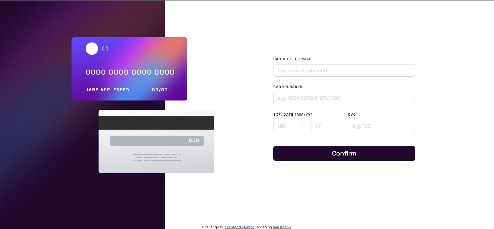

# Frontend Mentor - Interactive card details form solution

This is a solution to the [Interactive card details form challenge on Frontend Mentor](https://www.frontendmentor.io/challenges/interactive-card-details-form-XpS8cKZDWw). Frontend Mentor challenges help you improve your coding skills by building realistic projects. 

## Table of contents

- [Overview](#overview)
  - [The challenge](#the-challenge)
  - [Screenshot](#screenshot)
  - [Links](#links)
- [My process](#my-process)
  - [Built with](#built-with)
  - [What I learned](#what-i-learned)
  - [Continued development](#continued-development)
  - [Useful resources](#useful-resources)
- [Author](#author)

## Overview

### The challenge

Users should be able to:

- Fill in the form and see the card details update in real-time
- Receive error messages when the form is submitted if:
  - Any input field is empty
  - The card number, expiry date, or CVC fields are in the wrong format
- View the optimal layout depending on their device's screen size
- See hover, active, and focus states for interactive elements on the page

### Screenshot



### Links

- Solution URL: [here](https://www.frontendmentor.io/solutions/interactive-card-details-bootstrap-v52-scss-NOQJWBHZXM)
- Live Site URL: [here](https://hnvkhanh.github.io/interactive-card-details-form-main/)

## My process

### Built with

- Semantic HTML5 markup
- CSS custom properties
- Vanilla Javascript
- [Bootstrap v5.2](https://getbootstrap.com/docs/5.2/getting-started/introduction/)


### What I learned

`resize` and `load` event in Javascript:

```js
addEventListener('resize', (event) => {});

onresize = (event) => {};
```

```js
addEventListener('load', (event) => {});

onload = (event) => { };

```
Learn about variable in CSS.
```css
var(--name, value)
```
We can change CSS variable using Javascript but the same way is not true for SCSS variables.
```js
document.documentElement.style.setProperty("--scale", (window.innerWidth/1536));
```

### Continued development

This website responsiveness has not been great yet. It can be improved by changing the layout of html. Through this project I figure out that `html` layout also play a huge role when it come to responsiveness. In future project, I should better spend more time on deciding with `html` layout is best.

### Useful resources

- [W3School](https://www.w3schools.com/css/css3_variables.asp) - CSS variables.
- [Window: load envet](https://developer.mozilla.org/en-US/docs/Web/API/Window/load_event)
- [Window: resize envet](https://developer.mozilla.org/en-US/docs/Web/API/Window/resize_event) 
- [Spacing of Credit Card](https://w3programmings.com/how-to-add-letter-spacing-after-every-4-digits-of-credit-card-in-html-using-javascript/)


## Author

- Frontend Mentor - [@hnvkhanh](https://www.frontendmentor.io/profile/hnvkhanh)

